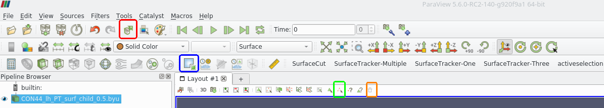

Below is a step-by-step procedure demonstrating how to use the surface tracking and cutting features to extract a custom region of a brain surface. If you use the CIS machines, you can use paraview-connie, which is a version of Paraview which should have the plugins loaded without you having to compile and load them first. Otherwise, **make sure to compile and load the 'SurfaceTracker-ManualSelection' and 'SurfaceCut-BoundaryFill' plugins beforehand, using these [instructions](https://github.com/conniejhe/Surface-Cutting/blob/master/README.md#compiling-and-loading-custom-plugins).**

This workflow can be significantly automated using the Python scripts located in [Scripts](../PythonScripts), which effectively chain several consecutive actions together in one click. However, it is beneficial to know the step-by-step procedure as well, in case things go wrong.

The following photo shows a few useful clarifications of where tools are located:
1. **Red**: Selecting this icon allows changes to be applied to parameters automatically, so you don't need to keep clicking 'Apply' in the Properties Panel following every step.
2. **Blue**: This is a shortcut for the 'Extract Selection' filter, which can otherwise be found under Filters -> Alphabetical -> Extract Selection.
3. **Green**: This is the 'Interactive Select Points Tool' which is used to select vertices on the mesh.
4. **Orange**: Use this trash can icon to deselect the current points.

This example uses the byu file named 'example_surface.byu'.

1. Load the 'example_surface.byu' file using the BYU Reader.
2. Using the 'Interactive Select Points Tool', select two points along the sulcus. Use the 'Extract Selection' tool to save these two points.
  

3. Select the 'Surface Tracker Manual' filter from the Filters dropdown menu and select 'example_surface.byu' as the Input and 'ExtractSelection1' as the Selection. Switch the line type to sulcus.
  

4. Using the 'Interactive Select Points Tool', deselect the first point (hold down Shift key and left click) and select a point at the end of the gyrus. Use the 'Extract Selection' tool to save these two points.
  

5. Select the 'Surface Tracker Manual' filter from the Filters dropdown menu and select 'example_surface.byu' as the Input and 'ExtractSelection2' as the Selection. Switch the line type to gyrus.
  

6. Using the 'Interactive Select Points Tool', deselect the second point and select the first point originally selected (to form a closed loop of vertices). Use the 'Extract Selection' tool to save these two points.
  

7. Select the 'Surface Tracker Manual' filter from the Filters dropdown menu and select 'example_surface.byu' as the Input and 'ExtractSelection3' as the Selection. Switch the line type to geodesic.
  

8. Now, select the three 'SurfaceTrackerManual' objects are simultaneously (click object in pipeline and hold down shift to add to the selection). Now that you have the individual three segments that comprise the loop, combine them using the 'Append Geometry' filter in the Filters dropdown menu.
  

9. Trash your existing points, then select a point inside the desired region which will act as the starting point for the surface cut algorithm. Extract it using the 'Extract Selection' tool. Make sure all the other points are deselected before this.
  

10. Select the 'Surface Cut' filter from the Filters dropdown menu and choose 'example_surface.byu' as Input, 'AppendGeometry1' as Path, and 'ExtractSelection4' as Inside Point.
  

